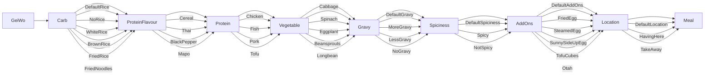
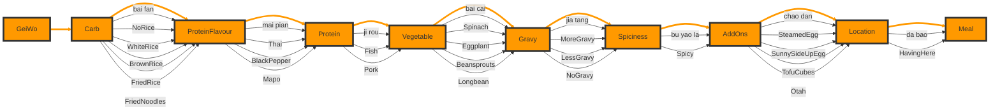

> [!IMPORTANT]  
> If you have experience in language development *(programmatic/linguistic)*, please drop me a message on LinkedIn. I would be really interested in developing `Seuss` into a more robust representative syntax that fixes the many archiac issues `.gf` and its contemporaries suffers from.  
> ~ Gabriel

# `Seuss`

What started as my attempt to use the rigid `.gf` syntax to arrive at a [universal language](https://en.wikipedia.org/wiki/Universal_language) has morphed into a simple Python script that visualises that syntax.

## Example

*(Note: The below example references files within the [`caifan`](./grammers/caifan) directory, specifically [`caifan.gf`](./grammers/caifan/caifan.gf) and [`parklane.gf`](./grammers/caifan/parklane.gf).)*

1. Define your **abstract** language syntax in `.gf` notation. 
2. Run `main.py` to generate the below flowchart.


```mermaid
graph LR
    GeiWo --> Carb
    Carb --> ProteinFlavour
    ProteinFlavour --> Protein
    Protein --> Vegetable
    Vegetable --> Gravy
    Gravy --> Spiciness
    Spiciness --> AddOns
    AddOns --> Location
    Location --> Meal

    Carb --> |DefaultRice| ProteinFlavour
    Carb --> |NoRice| ProteinFlavour
    Carb --> |WhiteRice| ProteinFlavour
    Carb --> |BrownRice| ProteinFlavour
    Carb --> |FriedRice| ProteinFlavour
    Carb --> |FriedNoodles| ProteinFlavour

    ProteinFlavour --> |Cereal| Protein
    ProteinFlavour --> |Thai| Protein
    ProteinFlavour --> |BlackPepper| Protein
    ProteinFlavour --> |Mapo| Protein

    Protein --> |Chicken| Vegetable
    Protein --> |Fish| Vegetable
    Protein --> |Pork| Vegetable
    Protein --> |Tofu| Vegetable

    Vegetable --> |Cabbage| Gravy
    Vegetable --> |Spinach| Gravy
    Vegetable --> |Eggplant| Gravy
    Vegetable --> |Beansprouts| Gravy
    Vegetable --> |Longbean| Gravy

    Gravy --> |DefaultGravy| Spiciness
    Gravy --> |MoreGravy| Spiciness
    Gravy --> |LessGravy| Spiciness
    Gravy --> |NoGravy| Spiciness

    Spiciness --> |DefaultSpiciness| AddOns
    Spiciness --> |Spicy| AddOns
    Spiciness --> |NotSpicy| AddOns

    AddOns --> |DefaultAddOns| Location
    AddOns --> |FriedEgg| Location
    AddOns --> |SteamedEgg| Location
    AddOns --> |SunnySideUpEgg| Location
    AddOns --> |TofuCubes| Location
    AddOns --> |Otah| Location

    Location --> |DefaultLocation| Meal
    Location --> |HavingHere| Meal
    Location --> |TakeAway| Meal
```

3. Specify a **concrete** implementation of that same syntax file to further generate a highlighted flowchart.


```mermaid
graph LR
    GeiWo --> Carb
    Carb --> ProteinFlavour
    ProteinFlavour --> Protein
    Protein --> Vegetable
    Vegetable --> Gravy
    Gravy --> Spiciness
    Spiciness --> AddOns
    AddOns --> Location
    Location --> Meal

    Carb -->|"bai fan"| ProteinFlavour
    Carb -->|NoRice| ProteinFlavour
    Carb -->|WhiteRice| ProteinFlavour
    Carb -->|BrownRice| ProteinFlavour
    Carb -->|FriedRice| ProteinFlavour
    Carb -->|FriedNoodles| ProteinFlavour

    ProteinFlavour -->|"mai pian"| Protein
    ProteinFlavour -->|Thai| Protein
    ProteinFlavour -->|BlackPepper| Protein
    ProteinFlavour -->|Mapo| Protein

    Protein -->|"ji rou"| Vegetable
    Protein -->|Fish| Vegetable
    Protein -->|Pork| Vegetable

    Vegetable -->|"bai cai"| Gravy
    Vegetable -->|Spinach| Gravy
    Vegetable -->|Eggplant| Gravy
    Vegetable -->|Beansprouts| Gravy
    Vegetable -->|Longbean| Gravy

    Gravy -->|"jia tang"| Spiciness
    Gravy -->|MoreGravy| Spiciness
    Gravy -->|LessGravy| Spiciness
    Gravy -->|NoGravy| Spiciness

    Spiciness -->|"bu yao la"| AddOns
    Spiciness -->|Spicy| AddOns

    AddOns -->|"chao dan"| Location
    AddOns -->|SteamedEgg| Location
    AddOns -->|SunnySideUpEgg| Location
    AddOns -->|TofuCubes| Location
    AddOns -->|Otah| Location

    Location -->|"da bao"| Meal
    Location -->|HavingHere| Meal

    classDef highlighted fill:#ff9900,stroke:#333,stroke-width:4px;
    class GeiWo,Carb,ProteinFlavour,Protein,Vegetable,Gravy,Spiciness,AddOns,Location,Meal highlighted;
    linkStyle 0,1,2,3,4,5,6,7,8 stroke:#ff9900,stroke-width:4px;
```

## Usage

```console
$ git clone https://github.com/gongahkia/seuss
$ python3 -m venv senv
$ source senv/bin/activate
$ pip install -r requirements.txt
$ python3 src/main.py
```

## Sidenote

The more astute among you might find the visualisation logic here familiar. That's because I just repurposed the interpreter from [`Yuho`](https://github.com/gongahkia/yuho) for this much simpler use case.

