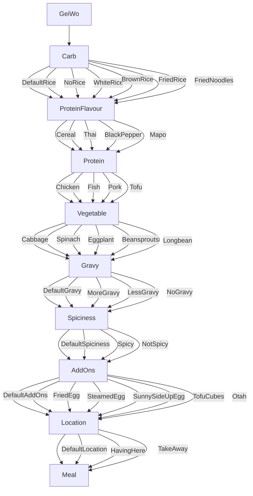
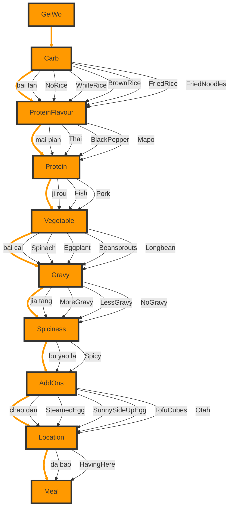

[](https://github.com/gongahkia/seuss/releases/tag/1.0.0)
[](https://github.com/gongahkia/seuss/releases/tag/2.0.0)

> [!IMPORTANT]  
> If you have experience in language development *(programmatic/linguistic)*, please drop me an email or a message on LinkedIn.    
> I would be really interested in collaborating on `Seuss` to develop a more robust system that can represent context-free and  
> context-rich grammers. The many archiac issues `.gf` and its contemporaries suffer from really pisses me off. A lot.  
> *~* *Gabriel*

# `Seuss`

What started as my attempt to use the rigid `.gf` syntax to arrive at a [universal language](https://en.wikipedia.org/wiki/Universal_language) has morphed into a simple Python script that visualises that syntax.

## Example

*(Note: The below example references files within the [`caifan`](./grammers/caifan) directory, specifically [`caifan.gf`](./grammers/caifan/caifan.gf) and [`parklane.gf`](./grammers/caifan/parklane.gf).)*

1. Define your **abstract** language syntax in `.gf` notation. 
2. Run `main.py` to generate the below flowchart.


```mermaid
graph TD
    GeiWo --> Carb
    Carb --> ProteinFlavour
    ProteinFlavour --> Protein
    Protein --> Vegetable
    Vegetable --> Gravy
    Gravy --> Spiciness
    Spiciness --> AddOns
    AddOns --> Location
    Location --> Meal

    Carb --> |DefaultRice| ProteinFlavour
    Carb --> |NoRice| ProteinFlavour
    Carb --> |WhiteRice| ProteinFlavour
    Carb --> |BrownRice| ProteinFlavour
    Carb --> |FriedRice| ProteinFlavour
    Carb --> |FriedNoodles| ProteinFlavour

    ProteinFlavour --> |Cereal| Protein
    ProteinFlavour --> |Thai| Protein
    ProteinFlavour --> |BlackPepper| Protein
    ProteinFlavour --> |Mapo| Protein

    Protein --> |Chicken| Vegetable
    Protein --> |Fish| Vegetable
    Protein --> |Pork| Vegetable
    Protein --> |Tofu| Vegetable

    Vegetable --> |Cabbage| Gravy
    Vegetable --> |Spinach| Gravy
    Vegetable --> |Eggplant| Gravy
    Vegetable --> |Beansprouts| Gravy
    Vegetable --> |Longbean| Gravy

    Gravy --> |DefaultGravy| Spiciness
    Gravy --> |MoreGravy| Spiciness
    Gravy --> |LessGravy| Spiciness
    Gravy --> |NoGravy| Spiciness

    Spiciness --> |DefaultSpiciness| AddOns
    Spiciness --> |Spicy| AddOns
    Spiciness --> |NotSpicy| AddOns

    AddOns --> |DefaultAddOns| Location
    AddOns --> |FriedEgg| Location
    AddOns --> |SteamedEgg| Location
    AddOns --> |SunnySideUpEgg| Location
    AddOns --> |TofuCubes| Location
    AddOns --> |Otah| Location

    Location --> |DefaultLocation| Meal
    Location --> |HavingHere| Meal
    Location --> |TakeAway| Meal
```

3. Specify a **concrete** implementation of that same syntax file to further generate a highlighted flowchart.


```mermaid
graph TD
    GeiWo --> Carb
    Carb --> ProteinFlavour
    ProteinFlavour --> Protein
    Protein --> Vegetable
    Vegetable --> Gravy
    Gravy --> Spiciness
    Spiciness --> AddOns
    AddOns --> Location
    Location --> Meal

    Carb -->|"bai fan"| ProteinFlavour
    Carb -->|NoRice| ProteinFlavour
    Carb -->|WhiteRice| ProteinFlavour
    Carb -->|BrownRice| ProteinFlavour
    Carb -->|FriedRice| ProteinFlavour
    Carb -->|FriedNoodles| ProteinFlavour

    ProteinFlavour -->|"mai pian"| Protein
    ProteinFlavour -->|Thai| Protein
    ProteinFlavour -->|BlackPepper| Protein
    ProteinFlavour -->|Mapo| Protein

    Protein -->|"ji rou"| Vegetable
    Protein -->|Fish| Vegetable
    Protein -->|Pork| Vegetable

    Vegetable -->|"bai cai"| Gravy
    Vegetable -->|Spinach| Gravy
    Vegetable -->|Eggplant| Gravy
    Vegetable -->|Beansprouts| Gravy
    Vegetable -->|Longbean| Gravy

    Gravy -->|"jia tang"| Spiciness
    Gravy -->|MoreGravy| Spiciness
    Gravy -->|LessGravy| Spiciness
    Gravy -->|NoGravy| Spiciness

    Spiciness -->|"bu yao la"| AddOns
    Spiciness -->|Spicy| AddOns

    AddOns -->|"chao dan"| Location
    AddOns -->|SteamedEgg| Location
    AddOns -->|SunnySideUpEgg| Location
    AddOns -->|TofuCubes| Location
    AddOns -->|Otah| Location

    Location -->|"da bao"| Meal
    Location -->|HavingHere| Meal

    classDef highlighted fill:#ff9900,stroke:#333,stroke-width:4px;
    class GeiWo,Carb,ProteinFlavour,Protein,Vegetable,Gravy,Spiciness,AddOns,Location,Meal highlighted;
    linkStyle 0,1,2,3,4,5,6,7,8 stroke:#ff9900,stroke-width:4px;
```

## Usage

The below instructions are for locally running `Seuss`.

1. First execute the below commands to install the repository locally.

```console
$ git clone https://github.com/gongahkia/seuss && cd seuss
$ python3 -m venv senv && source senv/bin/activate
$ pip install -r requirements.txt
```

2. Then run any of the below `Seuss` commands.
    1. `python3 src/main.py generate --abstract <abstract_definition_file> --concrete <instance_file>`: Generate sentences
        1. `-f png|pdf|svg|ascii`: Output format
        2. `-l <limit>`: Limit number of sentences
        3. `--filter <pattern>`: Filter sentences by pattern
        4. `--deduplicate`: Remove duplicate sentences
    2. `python3 src/main.py stats <abstract_definition_file>`: Show grammar statistics
    3. `python3 src/main.py validate <abstract_definition_file>`: Validate grammar
    4. `python3 src/main.py lint <abstract_definition_file>`: Lint grammar
        1. `--json`: Output lint results in JSON
    5. `python3 src/main.py export <abstract_definition_file> -f json`: Export grammar as JSON
    6. `python3 src/main.py export <abstract_definition_file> -f latex -o grammar.tex`: Export grammar as LaTeX
    7. `python3 src/main.py export <abstract_definition_file> -f html -o grammar.html`: Export grammar as HTML
    8. `python3 src/main.py import grammar.ebnf -o output.gf`: Import from EBNF
    9. `python3 src/main.py import grammar.bnf -n MyGrammar -o output.gf`: Import from BNF with grammar name
    10. `python3 src/main.py depgraph <abstract_definition_file> -o deps -f png`: Generate dependency graph
    11. `python3 src/main.py testgen --abstract <abstract_definition_file> --concrete <instance_file> -f json`: Generate test suite (JSON)
    12. `python3 src/main.py testgen --abstract <abstract_definition_file> --concrete <instance_file> -f pytest -o tests.py`: Generate test suite (pytest)
        1. `-d <depth>`: Set test depth
        2. `-n <max-tests>`: Set max number of tests
    13. `python3 src/main.py parallel --abstract <abstract_definition_file> --concrete <instance_file> grammers/caifan/english.gf -n 10`: Parallel generation (multilingual)
        1. `-f table|markdown|json`: Output format
    14. `python3 src/main.py ambiguity --abstract grammar.gf --concrete concrete.gf "your sentence here"`: Ambiguity detection
    15. `python3 src/main.py exhaust --abstract <abstract_definition_file> --concrete <instance_file> -d 5`: Exhaustive generation
    16. `python3 src/main.py merge grammar1.gf grammar2.gf -n MergedGrammar -o merged.gf`: Merge grammars
    17. `python3 src/main.py repl --abstract <abstract_definition_file> --concrete <instance_file>`: Interactive REPL
    18. `python3 src/main.py web -p 8080`: Launch web UI
    19. `python3 src/main.py watch --abstract <abstract_definition_file> --concrete <instance_file>`: Watch mode
    20. `diff`: Compare two grammars
    21. `parse`: Check if sentence matches grammar
    22. `sample`: Generate N random sentences
    23. `minimize`: Remove unreachable rules
    24. `batch`: Process directory of .gf files
    25. `template`: Generate new grammar template
    26. `subgraph`: Extract subgraph from category
    27. `complexity`: Analyze grammar complexity

## Sidenote

The more astute among you might find the visualisation logic here familiar. That's because I just repurposed the interpreter from [`Yuho`](https://github.com/gongahkia/yuho) for this much simpler use case.


