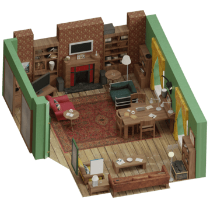

[](https://github.com/gongahkia/haus/releases/tag/1.0.0)

<!-- mcp-name: io.github.gongahkia/haus -->

# `Haus`

AI-agent interior design for Singapore HDB/BTO flats, powered by MCP.

`Haus` turns real public-housing floor plans and measured room references into a browser-based 3D layout editor that agents can operate with tools: place furniture, tag rooms, check walkways and sightlines, search IKEA catalog items, then export JSON, SVG, or GLB layouts.

<div align="center">
  <a href="./asset/demo/hero.mp4">
    
  </a>
  <br>
  <sub>Prompt: <code>design a minimalist 4-room family flat</code>. Click the demo for the 1080p MP4.</sub>
</div>

## Try the demo

One-command launch, no source checkout:

```console
$ uvx --from git+https://github.com/gongahkia/haus haus view
```

In the browser, open **Chat**, save an Anthropic/OpenAI/Gemini key in **Settings**, then try:

```text
design a minimalist 4-room family flat
```

The chat can also use live web references for interior-design/HDB research and accept attached room images as visual references to replicate in the current layout. The editor also has a guided Room Capture panel for measured room photos and an IKEA Catalog search panel backed by TinyFish when `TINYFISH_API_KEY` is set. Set `HAUS_ENABLE_WEB_SEARCH=0` before `haus view` if you want to disable live web lookup.

To connect an MCP client to the same live layout:

```console
$ uvx --from git+https://github.com/gongahkia/haus haus mcp --layout ~/.haus/viewer/mcp-layout.json
```

`uvx haus view` and `pipx install haus` are the intended short forms after a PyPI release; until then, use the GitHub `uvx --from` command above.

**HDB/BTO glossary:** HDB is Singapore public housing; BTO means Build-To-Order, a flat sold from floor-plan brochures before construction.

## Why it matters

* **Agent-native layout editing:** AI clients call MCP tools against real room objects instead of returning a static image.
* **Singapore-specific floor plans:** the corpus is built around HDB/BTO apartment layouts, not generic showrooms.
* **Exportable design state:** the editor keeps measurable 3D geometry that can be saved as JSON, SVG, or GLB.

## Source checkout usage

The below instructions are for developing `Haus` from a local checkout.

1. First run the below instructions to install `Haus` on your machine and install dependencies.

```console
$ git clone https://github.com/gongahkia/haus && cd haus
$ make setup
```

2. Then run any of the below commands.

```console
$ make build # process all corpus images
$ make view # launch web editor
$ make vectorize # run vectorization script only
$ make mcp # run standalone MCP server on stdio only
$ make case-server # run Stage-1 Renovation Design Case HTTP service
$ make test # run pytest suite only
$ make lint # run ruff linter only
$ make clean # remove build artifacts
$ make all # run linter, tests and build script
```

The AgentHack Stage-1 HTTP service exposes the case lifecycle from [`SPEC-HTTP-CASE.md`](./SPEC-HTTP-CASE.md), with SQLite persistence by default, optional Bearer-token auth, cache-first contractor handoff, and TinyFish vendor search when `TINYFISH_API_KEY` is set:

```console
$ haus case-server --port 8090 --proposals-dir tests/fixtures/proposals --vendor-cache-dir tests/fixtures/vendors
$ HAUS_CASE_API_TOKEN=dev-token haus case-server --port 8090 --case-db-path ~/.haus/cases/cases.sqlite3
```

Run the local Stage-1 fallback demo without UiPath:

```console
$ haus case demo --fixture corpus/library/3.json --pinned demo_3room_remove_wall_28 --max-revise-attempts 1 --handoff-root asset/demo/handoffs --out asset/demo/case-demo.json
$ haus view --case asset/demo/case-demo.json
```

Smoke-test a running Case HTTP service:

```console
$ HAUS_CASE_API_TOKEN=dev-token haus case-server --port 8090 --api-token dev-token --max-revise-attempts 1 --proposals-dir tests/fixtures/proposals --vendor-cache-dir tests/fixtures/vendors
$ HAUS_CASE_API_TOKEN=dev-token python scripts/case_smoke.py --base-url http://127.0.0.1:8090
$ curl -H "Authorization: Bearer $HAUS_CASE_API_TOKEN" http://127.0.0.1:8090/case/<case_id>
```

For a future Maestro spike, expose the local server through a tunnel such as `cloudflared tunnel --url http://127.0.0.1:8090` or `ngrok http 8090`, set the tunnel URL as the Maestro/API Workflow base URL, and keep `HAUS_CASE_API_TOKEN` enabled.

## UiPath AgentHack status

Target track: **Track 1 - UiPath Maestro Case**. Stage 1 is implemented as a standalone Haus HTTP service so the design/compliance/approval/handoff loop works without UiPath access. Stage 2 will wrap the same service in UiPath Maestro Case and replace the Stage-1 approval stub with Action Center.

Planned UiPath components:

| Component | Status | Role |
|---|---|---|
| Maestro Case | pending access | Case Manager, stage transitions, retry/escalation governance |
| Action Center + Apps | pending access | internal renovation coordinator approval |
| API Workflows or external workflow task | pending access | HTTP calls into the Haus Case service |
| Agent Builder | pending access | optional low-code Intake/brief agent |
| UiPath CLI + Coding Agents | pending `uip` install/auth | Codex-assisted UiPath pack/publish/deploy capture |

Agent split:

| Type | Used for |
|---|---|
| Coding agent | OpenAI Codex for this repo and planned UiPath CLI workflow after `uip login` |
| External coded agents | Haus Design Agent, Compliance Agent, Revise Loop, Vendor/Handoff Agent |
| Low-code/native UiPath agents | planned Agent Builder and Action Center/Maestro components |

Submission and wiring docs:

- [`SPEC-ACTION-CENTER.md`](./SPEC-ACTION-CENTER.md) - coordinator task copy, payload, decision mapping.
- [`SPEC-MAESTRO-WIRING.md`](./SPEC-MAESTRO-WIRING.md) - stage mapping, endpoint calls, retry policy.
- [`DEMO-SCRIPT.md`](./DEMO-SCRIPT.md) - 5-minute video script and screenshot checklist.
- [`SUBMISSION-DRAFT.md`](./SUBMISSION-DRAFT.md) - Devpost copy, architecture section, public repo checklist.

## Screenshots


## MCP server

`Haus`' MCP server exposes [a broad tool surface](#mcp-tool-reference) that integrates with the AI Chat within its web editor. It writes to `viewer/mcp-layout.json`, which the web editor polls every 2 seconds.

MCP registry/listing metadata lives in [`mcp-manifest.json`](./mcp-manifest.json), [`server.json`](./server.json), and [`MCP_REGISTRY_LISTINGS.md`](./MCP_REGISTRY_LISTINGS.md).

## MCP tool reference

| Category | Tools |
|---|---|
| **High-level design** | `design_room`, `design_flat` |
| **Catalog** | `list_furniture_catalog` |
| **IKEA catalog** | `search_ikea_catalog`, `get_ikea_catalog_item`, `add_catalog_furniture`, `refresh_ikea_catalog` |
| **Layout queries** | `list_objects`, `get_object_details`, `get_layout_summary`, `get_layout_json` |
| **Spatial** | `measure_distance`, `find_nearest`, `check_overlap`, `find_objects_in_area` |
| **Add** | `add_furniture`, `add_wall` |
| **Modify** | `move_object`, `rotate_object`, `resize_object`, `set_color`, `set_visibility` |
| **Batch** | `batch_move`, `align_objects`, `distribute_objects`, `snap_to_grid` |
| **Duplicate/Swap** | `duplicate_object`, `swap_furniture` |
| **Remove** | `remove_object`, `remove_objects_by_type`, `clear_layout` |
| **Naming/Rooms** | `rename_object`, `find_by_name`, `tag_room`, `list_rooms`, `compute_room_area` |
| **Sightlines/Access** | `check_sightline`, `score_doorway_accessibility`, `score_walkway` |
| **Placement simulation** | `suggest_furniture_placement`, `auto_place_furniture`, `suggest_placement_json`, `simulate_layout_options`, `apply_simulated_option` |
| **Room templates** | `list_room_templates`, `apply_room_template` |

## Demo fixture

The UiPath AgentHack pivot pins one floor plan as the canonical demo: `tests/fixtures/bto_3room_orange.jpg` (vectorized at `corpus/library/3.json`). See [`SPEC-HTTP-CASE.md`](./SPEC-HTTP-CASE.md#1-demo-fixture-pin) for the single source of truth.

## Stack

* *Frontend*: [JavaScript](https://developer.mozilla.org/en-US/docs/Web/JavaScript), [Three.js](https://threejs.org/)
* *Backend*: [Python](https://www.python.org/), [Starlette](https://www.starlette.io/), [Uvicorn](https://www.uvicorn.org/), [FastMCP](https://github.com/jlowin/fastmcp)
* *Preprocessing*: [OpenCV](https://opencv.org/), [NumPy](https://numpy.org/), [Pillow](https://pillow.readthedocs.io/)
* *3D*: [Trimesh](https://trimesh.org/), [Shapely](https://shapely.readthedocs.io/)
* *Tests*: [pytest](https://docs.pytest.org/), [ruff](https://docs.astral.sh/ruff/), [pyright](https://github.com/microsoft/pyright)
* *Package manager*: [uv](https://docs.astral.sh/uv/)

## Providers

`Haus`' AI chat panel supports the below 3 LLM providers currently.

| Provider | Env var | Default model | Install extra |
|---|---|---|---|
| [Anthropic](https://www.anthropic.com/) | `ANTHROPIC_API_KEY` | `claude-sonnet-4-20250514` | `uv pip install -e ".[anthropic]"` |
| [OpenAI](https://openai.com/) | `OPENAI_API_KEY` | `gpt-4o` | `uv pip install -e ".[openai]"` |
| [Google Gemini](https://ai.google.dev/) | `GEMINI_API_KEY` | `gemini-2.0-flash` | `uv pip install -e ".[gemini]"` |

For a fixed-prompt comparison of free/API routes that can drive the MCP workflow, see [`BENCHMARKS.md`](./BENCHMARKS.md).

## Architecture


## Credits

The idea for `Haus` was first conceived by [Zane](https://github.com/injaneity) and iterated on by [Wei Sin](https://github.com/weisintai) for the [OpenAI Codex Hackathon 2026](https://luma.com/fbhtrpfu?tk=1rZbrF), though it was later dropped in favour of [`codex-together`](https://github.com/injaneity/codex-together).

<table>
	<tbody>
        <tr>
            <td align="center">
                <a href="https://github.com/injaneity">
                    
                    <br />
                    <sub><b>Zane Chee</b></sub>
                </a>
                <br />
            </td>
            <td align="center">
                <a href="https://github.com/weisintai">
                    
                    <br />
                    <sub><b>Tai Wei Sin</b></sub>
                </a>
                <br />
            </td>
        </tr>
	</tbody>
</table>

## Other research

* [CubiCasa5k](https://github.com/CubiCasa/CubiCasa5k): Deep learning model for floor plan segmentation 

## Reference

The name `Haus` roughly translates to "House" in German (*das Haus*).

<div align="center">
  
</div>
