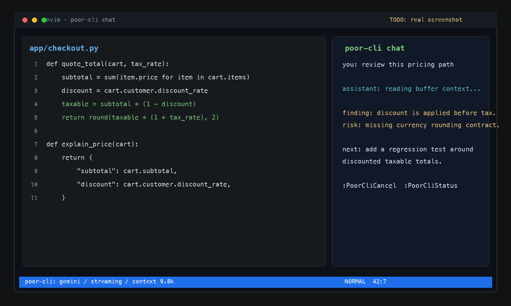
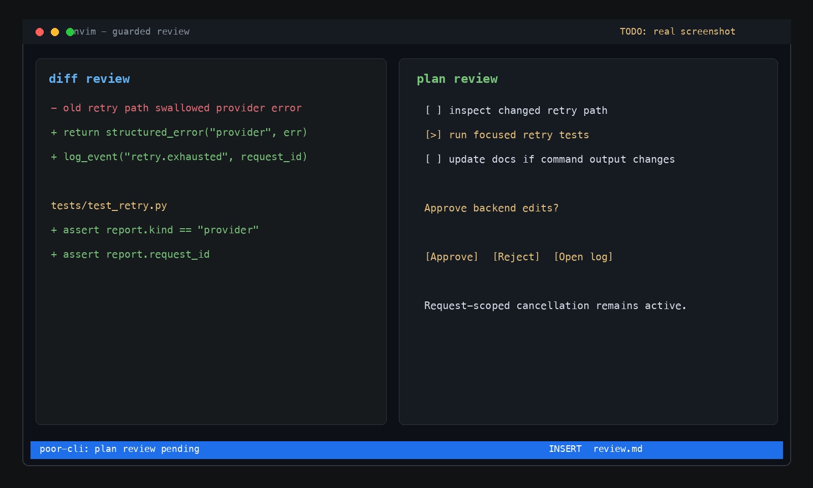
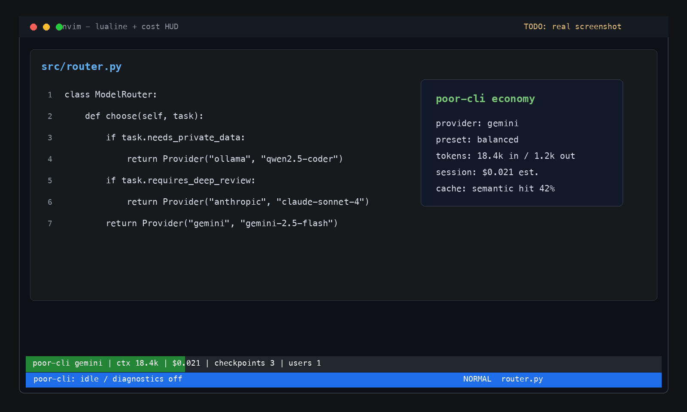
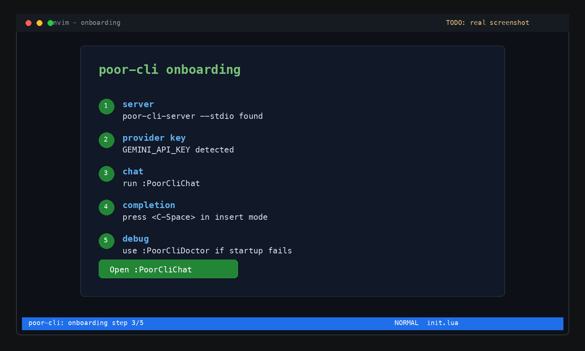
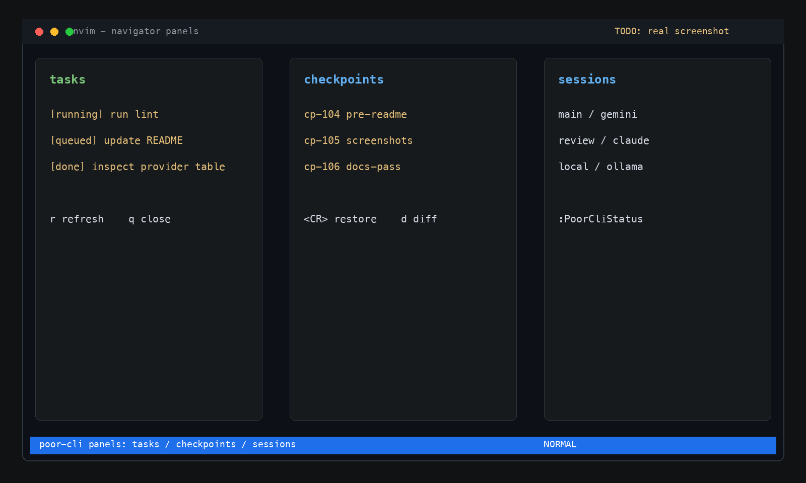

[](https://github.com/gongahkia/poor-cli/releases/tag/4.0.0)
[](https://github.com/gongahkia/poor-cli/releases/tag/5.0.0)


# `poor-cli`

```txt
               ____   ___   ___  ____        ____ _     ___
  {o,o}       |  _ \ / _ \ / _ \|  _ \      / ___| |   |_ _|
  /)__)       | |_) | | | | | | | |_) |    | |   | |    | |
  -"-"-       |  __/| |_| | |_| |  _ <     | |___| |___ | |
              |_|    \___/ \___/|_| \_\     \____|_____|___|
```

Provider-agnostic BYOK AI coding agent - Neovim-native, multiplayer-ready.

`nvim-poor-cli` gives Neovim inline ghost text, chat, plan review, checkpoints, context panels, and provider switching. The Python backend (`poor-cli-server --stdio`) owns model routing, tools, session state, policy checks, and multiplayer transport.

<!-- TODO: real screenshot. v6 placeholders are labeled in-image until owner-provided captures land. -->


## Install

```console
$ python3 -m pip install --upgrade 'poor-cli[all]'
```

```lua
{
    "gongahkia/poor-cli",
    submodules = false,
    config = function()
        require("poor-cli").setup({
            -- your options here
        })
    end,
}
```

## Quickstart

1. Install the Python package and Neovim plugin.
2. Export one provider key, for example `export GEMINI_API_KEY=...`.
3. Open Neovim and run `:PoorCliChat`.

Run `:checkhealth poor-cli` if the server does not start.

Credential lookup order is OS keyring, then env var, then plaintext config. Install `poor-cli[keyring]` or `poor-cli[all]` to enable macOS Keychain, Linux Secret Service, or Windows Credential Manager storage; env/plaintext fallback remains supported for CI and dev shells.

## Features

- Inline ghost text completion with manual trigger, accept, dismiss, and streaming partials.
- Chat panel with markdown rendering and request-scoped cancellation.
- Provider switching across Gemini, OpenAI, Anthropic, OpenRouter, and Ollama.
- Guarded plan review, diagnostics, trust status, checkpoints, run history, and context panels.
- `nvim-cmp` and `blink.cmp` completion integration.
- Invite-only multiplayer bridge from Neovim through the Python server.

## Screenshots






## How It Works

```txt
Neovim buffers, chat, panels
            |
            v
Lua plugin: nvim-poor-cli
            |
            v
JSON-RPC over stdio
            |
            v
Python server: poor-cli-server
            |
            +--> provider adapters
            +--> tool execution + policy
            +--> sessions + checkpoints
            +--> multiplayer bridge
```

## Model Support

`poor-cli` uses provider/model selection through the Python backend. Pass any model ID accepted by the selected provider.

| Provider | Key | Default Model | Common Models | Capabilities in `poor-cli` |
|---|---|---|---|---|
| Gemini | `gemini` | `gemini-2.5-flash` | `gemini-2.5-flash`, `gemini-2.5-pro`, `gemini-2.5-flash-lite` | Streaming, function calling, system instructions, vision, JSON mode |
| OpenAI | `openai` | `gpt-5.1` | `gpt-5.1`, `gpt-5`, `gpt-5-mini` | Streaming, function calling, system instructions, JSON mode, vision on GPT-5/GPT-4.1-class models |
| Anthropic / Claude | `anthropic` (alias: `claude`) | `claude-sonnet-4-20250514` | `claude-sonnet-4-20250514`, `claude-3-7-sonnet-20250219`, `claude-3-5-haiku-20241022` | Streaming, function calling, system instructions, vision |
| OpenRouter | `openrouter` | `anthropic/claude-sonnet-4-20250514` | `anthropic/claude-sonnet-4-20250514`, `openai/gpt-5`, `google/gemini-2.5-flash`, `meta-llama/llama-4-maverick`, `deepseek/deepseek-r1` | Streaming, function calling, system instructions, vision (model-dependent) |
| Ollama | `ollama` | `llama3.1` | Auto-discovered from local `ollama` (`/api/tags`), with fallbacks `llama3.1`, `qwen2.5-coder`, `mistral`, `codellama` | Streaming, system instructions, JSON mode, optional function calling for capable local models, local-only execution via `http://localhost:11434` |

## Multiplayer

`poor-cli-server` runs invite-only, owner-authoritative P2P sessions over WebRTC DataChannels. Neovim joins through the plugin bridge:

```lua
require("poor-cli").setup({
    multiplayer = {
        enabled = true,
        invite = "<signed-viewer-or-prompter-invite>",
    },
})
```

See [docs/MULTIPLAYER.md](./docs/MULTIPLAYER.md) for protocol details, invite format, host setup, and failure behavior.

## Commands

Neovim commands, keymaps, health checks, blink.cmp setup, and troubleshooting live in [nvim-poor-cli/README.md#commands](./nvim-poor-cli/README.md#commands).

Core entry points:

- `:PoorCliChat`
- `:PoorCliComplete`
- `:PoorCliStatus`
- `:PoorCliTrust`
- `:PoorCliDoctor`
- `:PoorCliCheckpoints`

## Development

Supported Python versions are `3.11`, `3.12`, `3.13`, and `3.14`.

```console
$ git clone https://github.com/gongahkia/poor-cli.git
$ cd poor-cli
$ python3 -m venv .venv
$ source .venv/bin/activate
$ python3 -m pip install -e '.[all,dev]'
$ make lint
$ make test
```

## License

MIT.

## Acknowledgements

Inspired by Neovim-native AI workflows and BYOK provider control.
