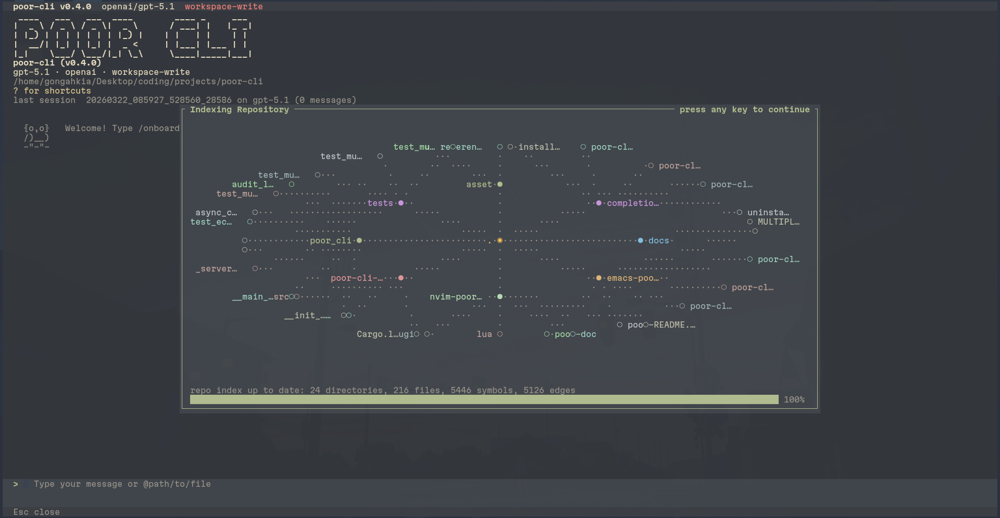
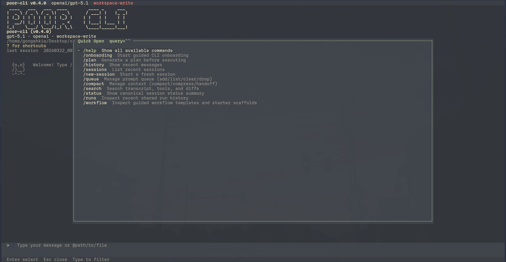
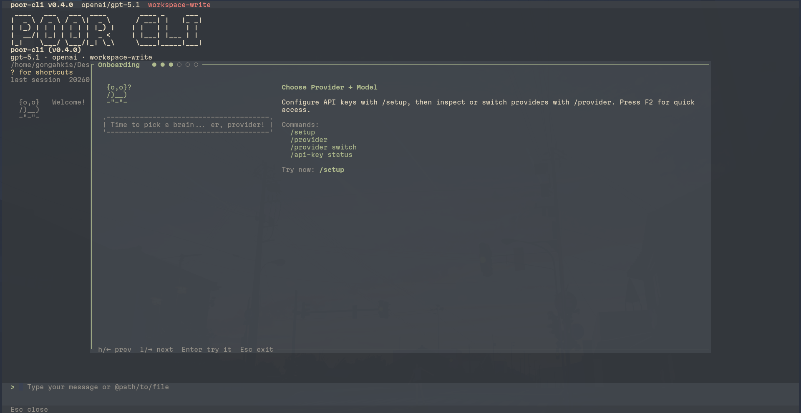
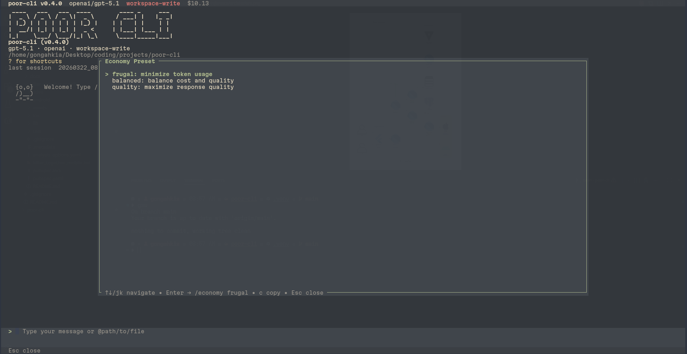
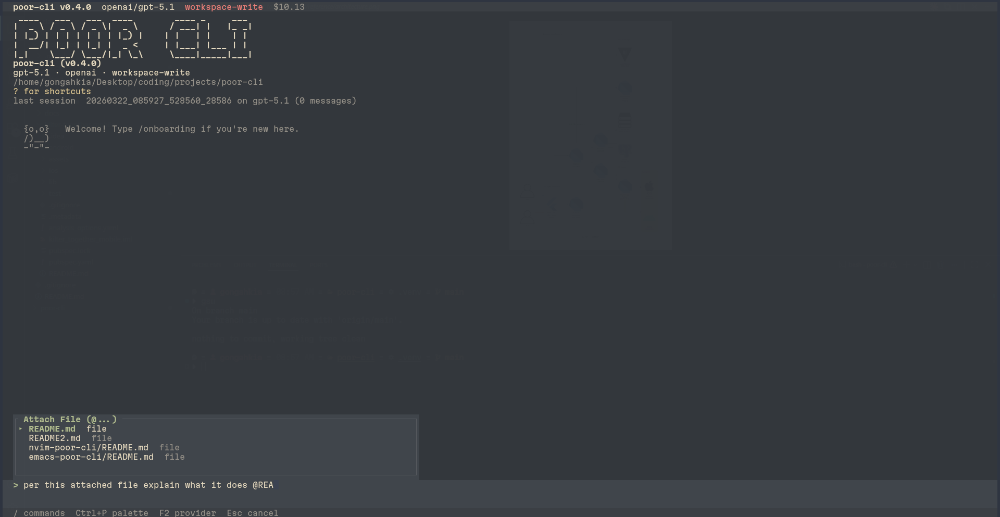
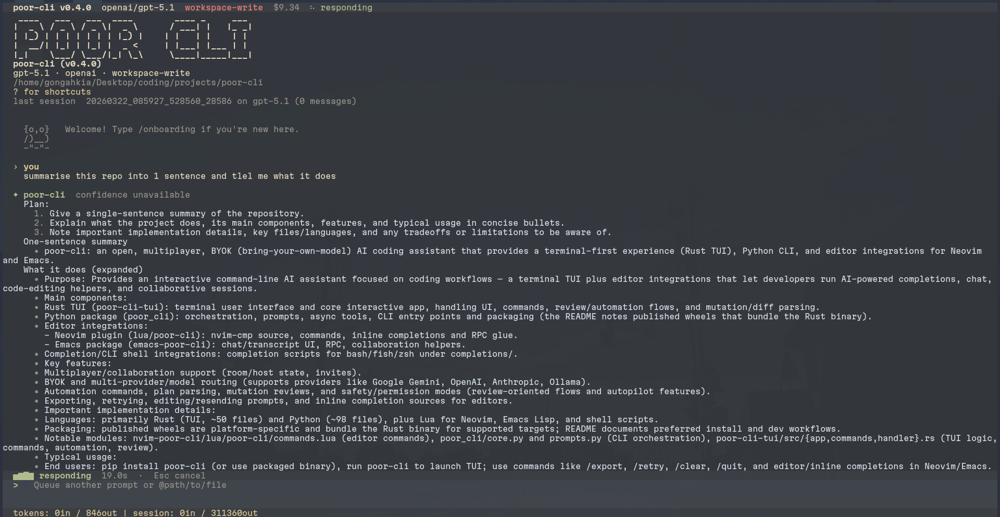

[](https://github.com/gongahkia/poor-cli/releases/tag/4.0.0)
[](https://github.com/gongahkia/poor-cli/releases/tag/5.0.0)


# `poor-cli`

Provider-[agnostic](https://www.merriam-webster.com/dictionary/agnostic) & [BYOK](#model-support), [multiplayer](#multiplayer) coding agent for the [CLI](https://en.wikipedia.org/wiki/Command-line_interface), [Neovim](https://neovim.io/), and [Emacs](https://www.gnu.org/software/emacs/). 

<div align="center">
    
</div>

## Stack

* *Script*: [Rust](https://rust-lang.org/), [Python](https://www.python.org/), [Lua](https://www.lua.org/), [Emacs Lisp](https://www.gnu.org/software/emacs/manual/html_node/elisp/), [Vim Script](https://vimhelp.org/usr_41.txt.html), [Bash](https://www.gnu.org/software/bash/)
* *Dependencies*: [ratatui](https://crates.io/crates/ratatui), [crossterm](https://crates.io/crates/crossterm), [tokio](https://crates.io/crates/tokio), [clap](https://crates.io/crates/clap), [serde](https://crates.io/crates/serde), [google-genai](https://pypi.org/project/google-genai/), [rich](https://pypi.org/project/rich/), [PyYAML](https://pypi.org/project/PyYAML/), [aiofiles](https://pypi.org/project/aiofiles/), [aiohttp](https://pypi.org/project/aiohttp/), [cryptography](https://pypi.org/project/cryptography/)
* *Optional SDKs*: [openai](https://pypi.org/project/openai/), [anthropic](https://pypi.org/project/anthropic/)
* *Distribution*: [Docker](https://www.docker.com/), [GitHub Actions](https://github.com/features/actions)

## Screenshots








## Usage

The below instructions are for locally installing and running `poor-cli`.

1. Ideally, install the published `poor-cli` package from [pip]() when you want the normal end-user path.

```console
$ python3 -m pip install --upgrade poor-cli
$ poor-cli install-info
$ poor-cli
```

2. Alternatively, clone `poor-cli` to modify and build it from source.

```console
$ git clone https://github.com/gongahkia/poor-cli.git && cd poor-cli
$ python3 -m venv .venv && source .venv/bin/activate
$ pip install uv
$ uv pip install ".[all]"
```

3. Then run any of the below commands to start `poor-cli`'s TUI.

```console
$ poor-cli                 
$ ./run.sh                   
$ ./run_tui.sh               

$ python3 -m poor_cli        

$ docker build -t poor-cli .
$ docker run -it --env-file .env poor-cli
```

4. To use `poor-cli`'s [Neovim plugin](https://neovim.io/), the easiest way to install this is with the [lazy.nvim](https://github.com/folke/lazy.nvim) package manager.

```lua
{
    "gongahkia/poor-cli",
    submodules = false,
    config = function()
        require("poor-cli").setup({
            trigger_key = "<C-Space>",  -- Trigger completion
            accept_key = "<Tab>",       -- Accept completion
            chat_key = "<leader>pc",    -- Toggle chat panel
            provider = nil,             -- Auto-detect from env
        })
    end,
}
```

5. To use `poor-cli`'s [Emacs](https://www.gnu.org/software/emacs/) package, call it directly within your Emacs configuration through the first-party package in `emacs-poor-cli/`.

```elisp
(require 'package)
(package-initialize)
(package-vc-install
 '(poor-cli
   :url "https://github.com/gongahkia/poor-cli"
   :lisp-dir "emacs-poor-cli"))

(require 'poor-cli)
(global-poor-cli-mode 1)
```

## Architecture


## Model support

`poor-cli` supports provider/model selection via `/switch` (inside TUI) or `--provider/--model` flags. You can pass any model ID accepted by the provider SDK/API.

| Provider | Key | Default Model | Common Models | Capabilities in `poor-cli` |
|---|---|---|---|---|
| Gemini | `gemini` | `gemini-2.5-flash` | `gemini-2.5-flash`, `gemini-2.5-pro`, `gemini-2.5-flash-lite` | Streaming, function calling, system instructions, vision, JSON mode |
| OpenAI | `openai` | `gpt-5.1` | `gpt-5.1`, `gpt-5`, `gpt-5-mini` | Streaming, function calling, system instructions, JSON mode, vision on GPT-5/GPT-4.1-class models |
| Anthropic / Claude | `anthropic` (alias: `claude`) | `claude-sonnet-4-20250514` | `claude-sonnet-4-20250514`, `claude-3-7-sonnet-20250219`, `claude-3-5-haiku-20241022` | Streaming, function calling, system instructions, vision |
| Ollama | `ollama` | `llama3.1` | Auto-discovered from local `ollama` (`/api/tags`), with fallbacks `llama3.1`, `qwen2.5-coder`, `mistral`, `codellama` | Streaming, system instructions, JSON mode, optional function calling for capable local models, local-only execution via `http://localhost:11434` |

## Multiplayer

`poor-cli-server` runs multiplayer as an invite-only, owner-authoritative [P2P](https://en.wikipedia.org/wiki/Peer-to-peer) session over [WebRTC DataChannels](https://developer.mozilla.org/en-US/docs/Web/API/WebRTC_API/Using_data_channels). The host prints signed viewer and prompter
invite codes for each room it serves.

### Start host

```console
$ poor-cli-server --host --bind 0.0.0.0 --port 8765 --room dev --room docs
```

### Optional ngrok helper

```console
$ poor-cli-server --host --bind 127.0.0.1 --port 8765 --room dev --ngrok
```

### Join from TUI

```console
$ poor-cli --remote-invite <signed-viewer-or-prompter-invite>
```

### Join from Neovim

```lua
require("poor-cli").setup({
    multiplayer = {
        enabled = true,
        invite = "<signed-viewer-or-prompter-invite>",
    },
})
```

Full protocol details, failure behavior, and compatibility notes are also available [here](./docs/MULTIPLAYER.md).

## Available Commands

Type `@path/to/file` in any message to attach file context.  
Use quoted refs for spaces: `@"docs/My File.md"` or `@'docs/My File.md'`.  
Run `!<command> [| optional question]` to execute local shell output and optionally ask the model about it.  

**Core Workflow:**
- `/help` - Show all available commands
- `/onboarding` - Start guided CLI onboarding
- `/plan` - Generate a plan before executing
- `/history` - Show recent messages
- `/sessions` - List recent sessions
- `/new-session` - Start a fresh session
- `/queue` - Manage prompt queue (add/list/clear/drop)
- `/compact` - Manage context (compact/compress/handoff)
- `/search` - Search transcript, tools, and diffs
- `/status` - Show canonical session status summary
- `/runs` - Inspect recent shared run history
- `/workflow` - Inspect guided workflow templates and starter scaffolds
- `/export` - Export conversation history
- `/retry` - Retry last request
- `/edit-last` - Edit and resend last prompt
- `/copy` - Copy last assistant response
- `/quit` - Exit the TUI
- `/exit` - Exit the TUI (alias)
- `/clear` - Clear conversation history
- `/clear-output` - Clear screen output only
- `/cost` - Show session token usage and estimated cost
- `/ollama-models` - List locally available Ollama models
- `/mcp-health` - Check health of MCP servers

**Review & Safety:**
- `/review` - Review code or staged diff
- `/test` - Generate tests for a file
- `/permission-mode` - Show permission mode
- `/sandbox` - Show or set sandbox preset
- `/instructions` - Inspect the active instruction stack
- `/memory` - Show or update repo-local memory
- `/policy` - Inspect repo-local hooks and audit status
- `/context` - Open backend context inspector or `/context explain`
- `/trust` - Open the trust center for provider, sandbox, rollback, and policy state
- `/timeline` - Open agent timeline and diffs
- `/explain-diff` - Explain behavior and risk in current diff
- `/fix-failures` - Analyze latest test/lint failure output
- `/checkpoints` - Browse and manage checkpoints
- `/checkpoint` - Create named checkpoint (optional label)
- `/save` - Quick checkpoint alias
- `/rewind` - Restore checkpoint (alias for /undo)
- `/restore` - Restore latest checkpoint (alias for /undo)
- `/diff` - Compare two files
- `/undo` - Undo file changes (restore last or specific checkpoint)
- `/plan-mode` - Toggle plan-first execution guidance
- `/gc` - Clean up stale checkpoints

**Providers & Config:**
- `/provider` - Show provider info, models, or switch (F2)
- `/switch` - Switch provider/model (alias for /provider switch)
- `/providers` - List providers (alias for /provider switch)
- `/config` - Show active configuration
- `/model-info` - Show model capabilities (alias for /provider)
- `/profile` - Set execution profile (speed|safe|deep-review)
- `/settings` - List editable config settings
- `/setup` - Open the guided setup summary and recommended first workflow
- `/env` - API key editor (alias for /setup)
- `/api-key` - Open the API key editor or use `/api-key status`
- `/verbose` - Toggle verbose logging
- `/toggle` - Toggle boolean config value
- `/set` - Set config key to a value
- `/theme` - Show or set UI theme (dark/light)
- `/tools` - List backend tools
- `/mcp` - Inspect or control MCP servers and tools

**Economy & Output:**
- `/broke` - Set poor mode (terse responses)
- `/my-treat` - Set rich mode (comprehensive responses)
- `/economy` - Show or switch economy preset (frugal|balanced|quality)
- `/savings` - Show economy savings dashboard

**Context & Reuse:**
- `/files` - List pinned context files
- `/add` - Pin file/directory for context
- `/drop` - Unpin context file
- `/clear-files` - Clear all pinned context files
- `/focus` - Manage persistent coding focus state
- `/resume` - Resume with branch/checkpoint/session summary
- `/workspace-map` - Summarize repository layout and hotspots
- `/bootstrap` - Detect project type and suggest quickstart commands
- `/context-budget` - Rank context files against a token budget
- `/image` - Queue image for next message
- `/save-prompt` - Save reusable prompt
- `/use` - Load and run saved prompt
- `/prompts` - List saved prompts
- `/save-session` - Save current session for later restore
- `/restore-session` - Restore most recent saved session

**Automation & Tasks:**
- `/autopilot` - Toggle bounded autonomous execution mode
- `/qa` - Run background QA watch for lint/tests
- `/task` - Manage durable background tasks, including retry and replay
- `/automation` - Inspect automation run history and replay automations
- `/inbox` - Show pending and actionable tasks
- `/skills` - Inspect or run repo and user skills
- `/commands` - Inspect or run repo and user commands
- `/watch` - Watch directory for changes
- `/unwatch` - Stop watch mode

**Services & Shell:**
- `/doctor` - Open structured diagnostics with remediation guidance
- `/service` - Manage local background services
- `/ollama` - Manage Ollama service and models
- `/run` - Run shell command via backend
- `/read` - Read file through backend
- `/pwd` - Show current working directory
- `/ls` - List files in directory

**Git & Workspace:**
- `/commit` - Create commit message from staged diff

**Collaboration:**
- `/collab` - Start, join, summarize, and manage collaboration sessions
- `/pass` - Hand driver role to the next collaborator
- `/suggest` - Send suggestion to the active driver
- `/leave` - Disconnect from collaboration session
## Available Tools

`poor-cli` can currently use these tools.

* *File & Workspace Tools*: `read_file`, `write_file`, `edit_file`, `list_directory`, `glob_files`, `grep_files`, `copy_file`, `move_file`, `delete_file`, `create_directory`, `diff_files`
* *Execution & Quality Tools*: `bash`, `run_tests`, `format_and_lint`, `dependency_inspect`, `process_logs`
* *Git Tools*: `git_status`, `git_diff`, `git_status_diff`, `apply_patch_unified`
* *Network/Data Tools*: `fetch_url`, `web_search`, `json_yaml_edit`
* *Optional GitHub Tools* *(available when `gh` CLI is installed)*: `gh_pr_list`, `gh_pr_view`, `gh_pr_create`, `gh_pr_comment`, `gh_issue_list`, `gh_issue_view`

## Other notes

Supported Python versions are `3.11`, `3.12`, `3.13`, and `3.14`.

For safety, `workspace-write` and `review-only` block shell commands that imply network access, including `curl`, `wget`, `gh`, and `git push`. Use `full-access` only when that network reach is intentional.
