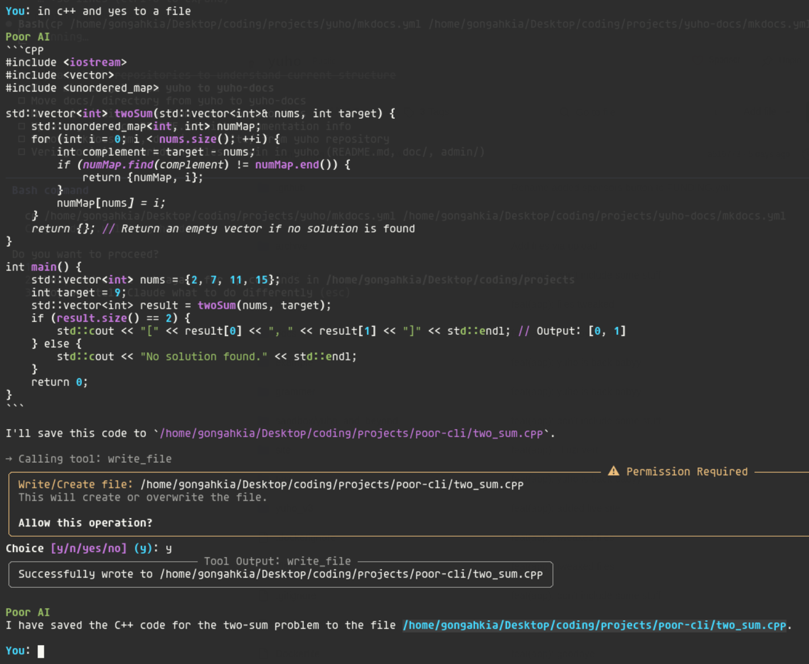

[](https://github.com/gongahkia/poor-cli/releases/tag/1.0.0)
[](https://github.com/gongahkia/poor-cli/releases/tag/2.0.0)
[](https://github.com/gongahkia/poor-cli/releases/tag/3.0.0)


# `poor-cli`

[BYOK](https://en.wikipedia.org/wiki/Bring_your_own_encryption) Agentic Coding Helper that lives in your Terminal *(now also available in **[Neovim](https://neovim.io/)**)*.

<div align="center">
    
</div>

## Stack

* *Script*: [Python](https://www.python.org/), [Lua](https://www.lua.org/), [Vim Script](https://vimhelp.org/usr_41.txt.html) 
* *Core Dependencies*: [google-generativeai](https://pypi.org/project/google-generativeai/), [rich](https://pypi.org/project/rich/), [PyYAML](https://pypi.org/project/PyYAML/), [aiofiles](https://pypi.org/project/aiofiles/), [aiohttp](https://pypi.org/project/aiohttp/), [cryptography](https://pypi.org/project/cryptography/), [prompt_toolkit](https://pypi.org/project/prompt_toolkit/)
* *Optional Provider Dependencies*: [openai](https://pypi.org/project/openai/), [anthropic](https://pypi.org/project/anthropic/)
* *Development Tools*: [black](https://black.readthedocs.io/), [ruff](https://docs.astral.sh/ruff/), [mypy](https://mypy.readthedocs.io/), [pytest](https://docs.pytest.org/)
* *Infrastructure*: [SQLite 3](https://www.sqlite.org/), [Docker](https://www.docker.com/), [GitHub Actions](https://github.com/features/actions)

## Usage

The below instructions are for locally hosting `poor-cli`. See screenshots [here](#screenshots).

1. First run the below

```console
$ git clone && cd poor-cli
$ python3 -m venv .venv && source .venv/bin/activate
$ pip install -r requirements.txt
```

2. Copy `.env.example` to `.env` and configure your preferred LLM providers by setting your API keys in `.env`. `poor-cli` supports [Gemini](https://aistudio.google.com/) *(free tier)*, [OpenAI](https://platform.openai.com/docs/models), [Anthropic](https://docs.claude.com/en/docs/about-claude/models/overview) and [Ollama](https://ollama.com/) *(local)*.

```console
$ cp .env.example .env
```

3. Now run the below to use the `poor-cli` CLI client.

```console
$ ./run.sh
$ python -m poor_cli
$ pip install -e .
$ poor-cli
$ ./uninstall.sh
```

4. Alternatively, install via [pip](https://pypi.org/project/pip/) for system-wide access.

```console
$ pip install poor-cli
```

5. You can also run `poor-cli` with [Docker](https://www.docker.com/).

```console
$ docker build -t poor-cli .
$ docker run -it --env-file .env poor-cli
```

6. Finally, you can also use `poor-cli` directly through a [Neovim plugin](https://neovim.io/), where it provides inline ghost text completion and a chat panel similar to [Windsurf](https://windsurf.com/) or [Copilot](https://copilot.microsoft.com/). The easiest way to install this is through the [lazy.nvim](https://github.com/folke/lazy.nvim) Package Manager.

```lua
{
    "gongahkia/poor-cli",
    submodules = false,
    config = function()
        require("poor-cli").setup({
            trigger_key = "<C-Space>",  -- Trigger completion
            accept_key = "<Tab>",       -- Accept completion
            chat_key = "<leader>pc",    -- Toggle chat panel
            provider = nil,             -- Auto-detect from env
        })
    end,
}
```

## Available Commands

**Session Management:**
- `/help` - Show help message
- `/quit` - Exit the REPL
- `/clear` - Clear current conversation
- `/history [N]` - Show recent messages (default: 10)
- `/sessions` - List all previous sessions
- `/new-session` - Start fresh session

**Checkpoints & Undo:**
- `/checkpoints` - List all checkpoints
- `/checkpoint` - Create manual checkpoint
- `/rewind [ID]` - Restore checkpoint (ID or 'last')
- `/diff <f1> <f2>` - Compare two files

**Provider Management:**
- `/provider` - Show current provider info
- `/providers` - List all available providers and models
- `/switch` - Switch AI provider

**Export & Archive:**
- `/export [format]` - Export conversation (json, md, txt)

**Configuration:**
- `/config` - Show current configuration
- `/verbose` - Toggle verbose logging
- `/plan-mode` - Toggle plan mode

**Neovim Commands:**
- `:PoorCliStart`: Start the AI server
- `:PoorCliStop`: Stop the AI server
- `:PoorCliStatus`: Show server status
- `:PoorCliChat`: Toggle chat panel
- `:PoorCliComplete`: Trigger inline completion
- `:'<,'>PoorCliExplain`: Explain selected code
- `:'<,'>PoorCliRefactor`: Refactor selected code
- `:checkhealth poor-cli`: Verify your Neovim setup

## Available Tools

`poor-cli` can currently use these tools.

- read_file: Read file contents with optional line ranges
- write_file: Create or overwrite files
- edit_file: Edit files using string replacement or line-based editing
- glob_files: Find files matching patterns (e.g., `**/*.py`)
- grep_files: Search for text in files using regex
- bash: Execute bash commands with timeout support

## Architecture


## Screenshots





