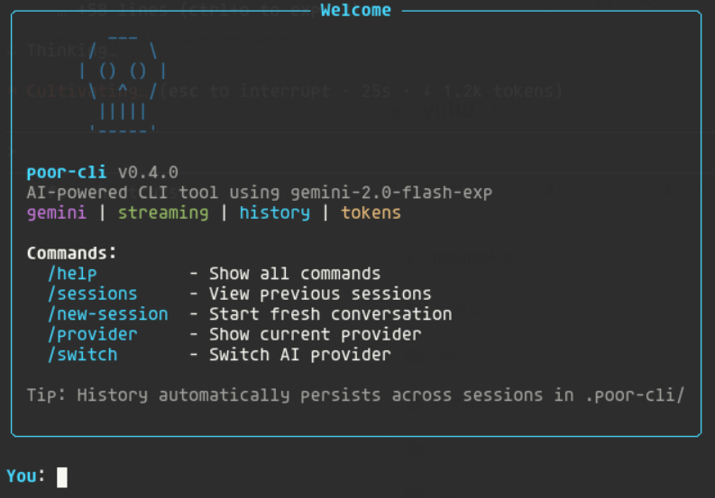

[](https://github.com/gongahkia/poor-cli/releases/tag/1.0.0)
[](https://github.com/gongahkia/poor-cli/releases/tag/2.0.0)
[](https://github.com/gongahkia/poor-cli/releases/tag/3.0.0)


# `poor-cli`

[BYOK](https://en.wikipedia.org/wiki/Bring_your_own_encryption) Agentic Coding Helper that lives in your Terminal *(now also available in [Neovim](https://neovim.io/))*!

<div align="center">
    
</div>

## Stack

### Languages
* [Python](https://www.python.org/) 3.8+ - Core application (51 modules, 22,000+ lines)
* [Lua](https://www.lua.org/) - Neovim plugin (14 modules)
* [Vim Script](https://vimhelp.org/usr_41.txt.html) - Plugin entry point

### Core Dependencies
| Package | Version | Purpose |
|---------|---------|---------|
| [google-generativeai](https://pypi.org/project/google-generativeai/) | ≥0.3.0 | Gemini API client |
| [rich](https://pypi.org/project/rich/) | ≥13.0.0 | Terminal formatting & UI |
| [PyYAML](https://pypi.org/project/PyYAML/) | ≥6.0 | Configuration parsing |
| [aiofiles](https://pypi.org/project/aiofiles/) | ≥23.0.0 | Async file operations |
| [aiohttp](https://pypi.org/project/aiohttp/) | ≥3.9.0 | Async HTTP client |
| [cryptography](https://pypi.org/project/cryptography/) | ≥41.0.0 | API key encryption |
| [prompt_toolkit](https://pypi.org/project/prompt_toolkit/) | ≥3.0.0 | Interactive input |

### Optional Provider Dependencies
| Package | Version | Purpose |
|---------|---------|---------|
| [openai](https://pypi.org/project/openai/) | ≥1.0.0 | OpenAI/GPT-4 support |
| [anthropic](https://pypi.org/project/anthropic/) | ≥0.18.0 | Claude/Anthropic support |

### Development Tools
| Tool | Purpose |
|------|---------|
| [black](https://black.readthedocs.io/) | Code formatting |
| [ruff](https://docs.astral.sh/ruff/) | Linting |
| [mypy](https://mypy.readthedocs.io/) | Type checking |
| [pytest](https://docs.pytest.org/) | Testing |

### Infrastructure
* [SQLite 3](https://www.sqlite.org/) - History, cache, and audit log storage
* [Docker](https://www.docker.com/) - Containerization (Python 3.11-slim base)
* [GitHub Actions](https://github.com/features/actions) - CI/CD pipeline

## Usage

The below instructions are for locally hosting `poor-cli`. See screenshots [here](#screenshots).

1. First run the below

```console
$ git clone && cd poor-cli
$ python3 -m venv .venv && source .venv/bin/activate
$ pip install -r requirements.txt
```

2. Copy `.env.example` to `.env` and configure your preferred LLM providers by setting your API keys in `.env`. `poor-cli` supports [Gemini](https://aistudio.google.com/) *(free tier)*, [OpenAI](https://platform.openai.com/docs/models), [Anthropic](https://docs.claude.com/en/docs/about-claude/models/overview) and [Ollama](https://ollama.com/) *(local)*.

```console
$ cp .env.example .env
```

3. Now run the below to use the `poor-cli` CLI client.

```console
$ ./run.sh
$ python -m poor_cli
$ pip install -e .
$ poor-cli
$ ./uninstall.sh
```

4. Alternatively, install via pip for system-wide access:

```console
$ pip install poor-cli
$ pip install poor-cli[openai]      # with OpenAI support
$ pip install poor-cli[anthropic]   # with Claude support
$ pip install poor-cli[all]         # with all providers
```

5. Or run with Docker:

```console
$ docker build -t poor-cli .
$ docker run -it --env-file .env poor-cli
```

### Neovim Plugin

The Neovim plugin provides inline ghost text completion (like Copilot/Windsurf) and a chat panel. See full documentation in [nvim-poor-cli/README.md](./nvim-poor-cli/README.md).

#### Quick Install (lazy.nvim)

```lua
{
    "gongahkia/poor-cli",
    submodules = false,
    config = function()
        require("poor-cli").setup({
            trigger_key = "<C-Space>",  -- Trigger completion
            accept_key = "<Tab>",       -- Accept completion
            chat_key = "<leader>pc",    -- Toggle chat panel
            provider = nil,             -- Auto-detect from env
        })
    end,
}
```

#### Key Neovim Commands

| Command | Description |
|---------|-------------|
| `:PoorCliStart` | Start the AI server |
| `:PoorCliStop` | Stop the AI server |
| `:PoorCliStatus` | Show server status |
| `:PoorCliChat` | Toggle chat panel |
| `:PoorCliComplete` | Trigger inline completion |
| `:'<,'>PoorCliExplain` | Explain selected code |
| `:'<,'>PoorCliRefactor` | Refactor selected code |

Run `:checkhealth poor-cli` to verify your Neovim setup.

## Available Commands

**Session Management:**
- `/help` - Show help message
- `/quit` - Exit the REPL
- `/clear` - Clear current conversation
- `/history [N]` - Show recent messages (default: 10)
- `/sessions` - List all previous sessions
- `/new-session` - Start fresh session

**Checkpoints & Undo:**
- `/checkpoints` - List all checkpoints
- `/checkpoint` - Create manual checkpoint
- `/rewind [ID]` - Restore checkpoint (ID or 'last')
- `/diff <f1> <f2>` - Compare two files

**Provider Management:**
- `/provider` - Show current provider info
- `/providers` - List all available providers and models
- `/switch` - Switch AI provider

**Export & Archive:**
- `/export [format]` - Export conversation (json, md, txt)

**Configuration:**
- `/config` - Show current configuration
- `/verbose` - Toggle verbose logging
- `/plan-mode` - Toggle plan mode

## Available Tools

`poor-cli` can currently use these tools.

- read_file: Read file contents with optional line ranges
- write_file: Create or overwrite files
- edit_file: Edit files using string replacement or line-based editing
- glob_files: Find files matching patterns (e.g., `**/*.py`)
- grep_files: Search for text in files using regex
- bash: Execute bash commands with timeout support

## Architecture

```mermaid

```

## Screenshots




