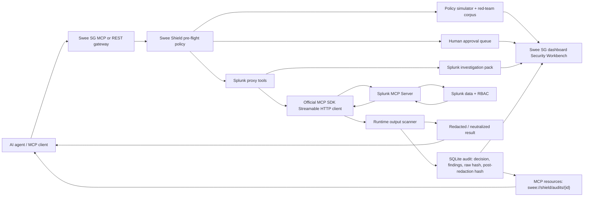

# Swee Shield Splunk Proxy Architecture

## Data Flow

1. Agent calls `swee_shield_splunk_investigation_pack`, `splunk_search`, `splunk_list_indexes`, or `splunk_list_saved_searches`.
2. Swee Shield evaluates tool metadata and Splunk SPL policy before any upstream call.
3. Broad/unbounded SPL can require `swee_shield_approval_decide` when `SWEE_SHIELD_APPROVAL_MODE=queue`.
4. Proxy handler calls the configured Splunk MCP endpoint with bearer auth after policy and approval checks.
5. Runtime scanner redacts credential/PII-shaped output and neutralizes prompt-injection text.
6. If `SWEE_SHIELD_RUNTIME_SCAN_MODE=block`, critical runtime findings block the result and still write the audit row.
7. Audit store persists sanitized input, policy decision, runtime findings, raw output hash, and post-redaction output hash when a defended result is returned.
8. The dashboard shows investigation pack searches, timeline rows, policy simulator matrix, approvals, decisions, finding counts, short hash IDs, and audit IDs.
9. MCP clients can inspect evidence resources under `swee://shield/audits/{id}`, `swee://shield/approvals/{id}`, and `swee://shield/redteam/corpus`.

## AI Integration

Foundation-sec and other investigation agents should consume only the post-scanner result returned by Swee Shield. Deep Time Series or other model-driven anomaly layers can be added as downstream consumers of defended Splunk results; no agent should call Splunk directly.

## Claim Boundary

The audit trail stores hash evidence for inspection. It does not provide deterministic replay of upstream Splunk responses.

The gateway readiness check reports whether Splunk MCP config is present. It does not prove live Splunk auth or upstream availability.
