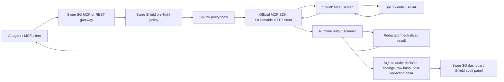

# Swee Shield Splunk Proxy Architecture

## Data Flow

1. Agent calls `splunk_search`, `splunk_list_indexes`, or `splunk_list_saved_searches`.
2. Swee Shield evaluates tool metadata and policy before any upstream call.
3. Proxy handler calls the configured Splunk MCP endpoint with bearer auth.
4. Runtime scanner redacts credential/PII-shaped output and neutralizes prompt-injection text.
5. Audit store persists sanitized input, policy decision, runtime findings, raw output hash, and post-redaction output hash.
6. The dashboard shows recent decisions, reason codes, finding counts, and audit IDs.

## AI Integration

Foundation-sec and other investigation agents should consume only the post-scanner result returned by Swee Shield. Deep Time Series or other model-driven anomaly layers can be added as downstream consumers of defended Splunk results; no agent should call Splunk directly.

## Claim Boundary

The audit trail is tamper-evident and hash-verified. It is inspection-only and does not provide deterministic replay of upstream Splunk responses.
