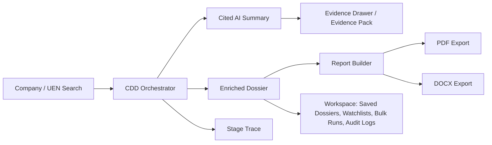

# Architecture

Dude is now a CDD-only product.

The system has two surfaces:

1. `packages/mcp-server`: the bounded runtime for Singapore company/UEN diligence tools.
2. `apps/web`: the report-first analyst UI for search, cited summary review, evidence inspection, workspace workflows, and exports.

## Product Flow

The primary experience is not a tabbed public-data explorer. The first useful screen is the CDD summary with citations. Raw records, source details, provenance, gaps, limits, and supplemental evidence live in the Evidence Pack and drawer interactions.

## Runtime Scope

The MCP runtime exposes 28 `sg_*` tools across 11 CDD catalog families.

Retained CDD families:

- ACRA entity identity
- BCA builders and contractors
- BOA architects and architecture firms
- CEA salespersons
- GeBIZ tenders
- HSA pharmacies and health-product licensees
- HLB hotels
- External diligence signals: sanctions, OpenCorporates links, adverse-media hints, relationship graph
- Safe counterparty resolution and structured CDD report orchestration
- Business dossier composition
- Ops: health, cache, key, config, trace, request lookup

Removed from runtime/product discovery:

- property and housing
- macro and financial statistics
- transport and transit ops
- weather/environment
- civic amenities
- generic data.gov drilldowns
- visualization
- law search
- COE, IRAS, SPF, EMA, NLB, and similar broad public-data families

## Query Planner

`sg_query` only plans or executes CDD entity and sector diligence workflows, and execution uses the CDD orchestrator path. `sg_resolve_counterparty` is the structured preflight for fuzzy name normalization and ambiguous candidate confirmation; `sg_cdd_report` is the structured MCP report interface. Non-CDD prompts return an explicit unsupported response. This keeps the agent contract honest and avoids pretending Dude is a general Singapore data assistant.

Supported workflow families:

- company CDD report
- architecture firm diligence
- healthcare supplier diligence
- hotel operator lookup
- sector-scoped business diligence

## Report Model

The web app uses a shared report model:

- `ReportTemplate`
- `ReportSectionId`
- `ReportWritingStyle`
- `ReportExportFormat`
- `ReportDocumentModel`

Report sections can be included/excluded and reordered. Writing style is constrained to controlled CDD presets. PDF and DOCX are first-class report exports; JSON and CSV are advanced data exports.

## Evidence Contract

CDD output must preserve:

- cited findings
- exact supporting evidence
- provenance
- freshness
- gaps
- limits
- confidence blockers
- next actions
- report manifest data

No component should turn missing public evidence into a positive clearance claim.
