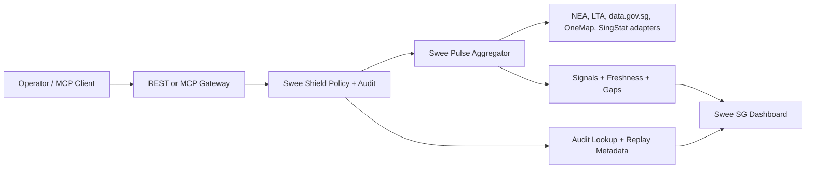

# Architecture

Swee SG is a local-first Singapore public-data runtime with two app-facing surfaces:

1. `packages/mcp-server`: MCP and REST runtime for Swee Pulse, Swee Shield, and retained raw `sg_*` source adapters.
2. `apps/web`: signal-first dashboard for source-backed mobility, weather, source health, freshness gaps, and Shield audit review.

## Product Flow

The primary experience is not a generic data browser. It starts with an operator-readable Pulse snapshot: what is happening, which sources are healthy, what is missing, and which follow-up checks are justified.

## Runtime Scope

Product families:

- Swee Pulse: source-backed mobility, weather, source-health, and deterministic explain signals.
- Swee Shield: policy decisions, audit lookup, replay metadata, and MCP poisoning scanner warnings.
- Raw source adapters: direct `sg_*` tools for callers with exact structured inputs.
- Operations: health, cache, key, config, trace, and request lookup.

The old report-first CDD product path is not the product entrypoint. Compatibility code may still exist while the migration finishes, but new docs, demos, release checks, and UI surfaces should route through Pulse and Shield.

## Pulse Contract

Pulse output must preserve:

- signal severity and summary
- source provenance
- observed freshness
- source health
- gaps and limits
- recommended operator actions

Pulse signals are deterministic transformations of source records. Optional AI is explain-only and must not create data, change severity, or hide gaps.

## Shield Contract

Shield wraps tool execution with:

- mode-aware policy decisions
- sanitized audit payloads
- replay hashes
- trace and request identifiers
- scanner findings for risky tool descriptions or schemas

The audit trail is local-first SQLite state. Secrets must remain redacted in stored payloads.

## REST Shortcuts

The generic tool route remains `POST /api/v1/<tool-name>`. The dashboard also uses app-level shortcuts:

- `GET /api/v1/pulse/snapshot`
- `GET /api/v1/pulse/weather`
- `GET /api/v1/pulse/mobility`
- `GET /api/v1/shield/audits`
- `GET /api/v1/shield/scan`

## Web Model

The web app favors dense operational views:

- signal overview metrics
- mobility and weather groups
- source-health tables
- gap summaries
- Shield audit rows
- optional explain-only AI status

UI copy should make the takeaway obvious: what changed, which source supports it, what is stale or missing, and what to check next.
