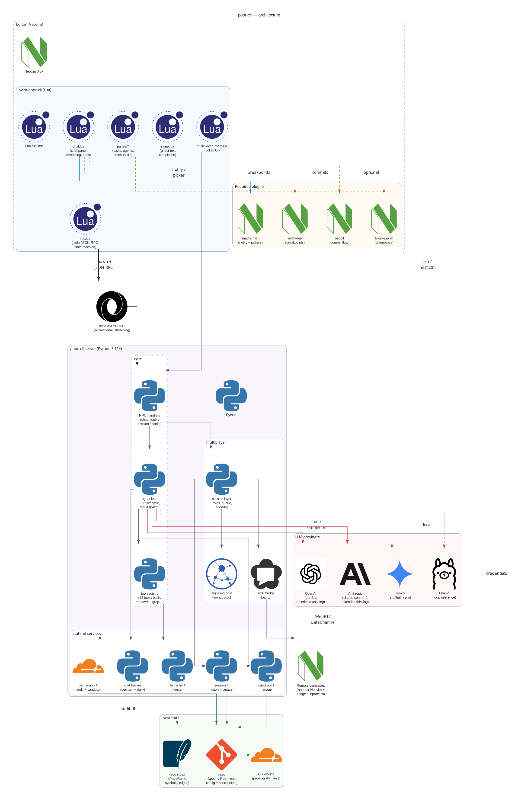

# Architecture diagram



## Regenerate

```bash
# One-time setup
python3 -m venv .venv && . .venv/bin/activate
pip install diagrams cairosvg
# System requirement
sudo dnf install graphviz   # or apt/brew

# Build
python3 docs/architecture/generate_diagram.py
```

Outputs `docs/architecture/poor_cli_architecture.png`.

## How it works

`generate_diagram.py` uses [mingrammer/diagrams](https://diagrams.mingrammer.com/), a Python DSL over Graphviz, to emit the PNG. Logos are pulled from [simpleicons.org](https://simpleicons.org/)'s CDN plus a couple of GitHub org avatars (OpenAI, which isn't on simpleicons due to branding policy). First run caches them to `docs/architecture/assets/`; subsequent runs reuse the cache so only the diagram layout re-renders.

## Editing

Node definitions are in `generate_diagram.py` inside the `build()` function, grouped by `Cluster`. Each `Custom(label, logo_path)` call becomes a box with the given PNG. Edges use `>>` / `<<` / `-` with optional `Edge(color=, label=, style=)` to label data flow.

To add a new provider or module, drop a new `Custom(...)` inside the appropriate `Cluster`, then wire it with an edge. To use a new logo, add it to the `LOGOS` dict at the top of the file (simpleicons format: `f"{SI}/<slug>/<hexcolor>"`).
