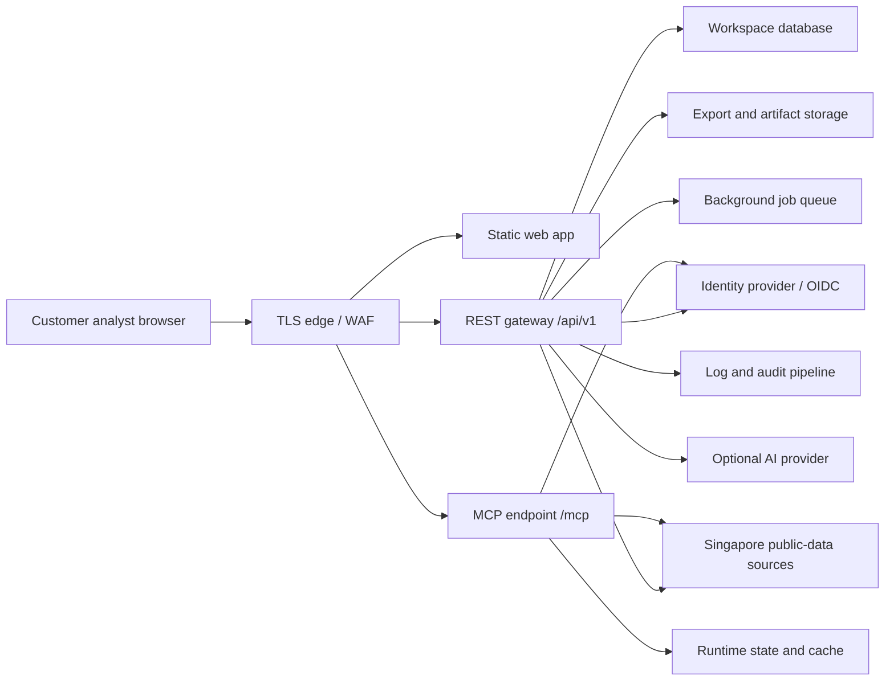

# Dude Cloud Security Architecture

This document defines the target hosted architecture for Dude Cloud. It is a product and engineering control plan, not a certification, audit report, legal opinion, or customer contract.

## Success Definition

- Hosted topology, tenancy model, secrets handling, backups, logging, and retention are documented in one place.
- Data residency and subprocessor decisions are explicit blockers rather than implied sales promises.
- SOC 2 and MAS outsourcing readiness gaps map back to concrete architecture controls.
- Follow-up infrastructure and product issues are recorded so hosted work can be implemented without weakening the OSS/self-host surface.

## Hosted Boundary

| Surface | Hosted responsibility | Outside hosted boundary |
| --- | --- | --- |
| Web app | Dude-operated browser UI, workspace routes, dossier search, exports, bulk workflows, admin surfaces. | Customer browser profile, customer network controls, downloaded files after export. |
| REST gateway | Same-origin API under `/api/v1`, request validation, workspace authorization, rate limits, debug/admin endpoints. | Direct customer API clients unless separately contracted and authenticated. |
| MCP endpoint | Public Streamable HTTP MCP endpoint under `/mcp`, OIDC-protected for hosted use. | Local stdio MCP installs and customer-managed MCP deployments. |
| Data store | Hosted workspace metadata, saved dossiers, audit events, export manifests, logs, billing/entitlement state. | Upstream public registries and customer systems of record. |
| Operations | Deployment, monitoring, incident response, backup/restore, support access, subprocessor management. | Customer analyst decisions, legal/tax/compliance advice, customer regulatory obligations. |

The current single-node Docker deployment in [deployment.md](./deployment.md) is a dev and early pilot topology. Production Dude Cloud should use the same route split (`/`, `/api/v1`, `/mcp`) but must replace single-volume persistence with managed storage, managed backups, controlled admin access, and monitored audit trails before handling real customer data.

## Target Topology

Production requirements:

- terminate TLS at an edge that supports exact-origin CORS, request-size limits, rate limits, and security headers;
- keep web, REST, MCP, worker, database, object storage, logs, and secrets as separately owned assets in the hosted asset inventory;
- run REST/MCP processes with least-privilege service identities;
- route background bulk dossiers, exports, watchlists, and alert jobs through a queue instead of tying them to browser request lifetimes;
- maintain separate production, staging, and development environments with isolated secrets, databases, object stores, and log sinks.

## Tenancy Model

The required production tenancy model is workspace-scoped logical isolation:

- every user belongs to one or more workspaces;
- every dossier, memo, bulk job, export, watchlist, audit event, and billing entitlement carries `workspaceId`;
- every request authorization check is evaluated against `workspaceId`, actor role, and action;
- cross-workspace queries are denied by default, including admin and support tooling;
- support access uses time-boxed impersonation or break-glass approval and always emits immutable audit events;
- workspace deletion triggers product deletion, export revocation where possible, and backup expiry according to the customer retention policy.

Do not sell enterprise hosted work until production identity configuration, admin access reviews, support-access approval, break-glass evidence, backup/restore evidence, and source-licensing gates are complete and tested.

## Data Classes

| Data class | Examples | Storage posture |
| --- | --- | --- |
| Public registry evidence | ACRA identity rows, GeBIZ awards, BCA/CEA/BOA/HSA/HLB matches, source URLs, observed timestamps. | Persist only when tied to a workspace dossier or cache policy; preserve provenance and freshness. |
| Customer workspace data | Workspace name, user emails, roles, folders, saved dossiers, shortlist, bulk uploads. | Encrypt in transit and at rest; delete by workspace retention policy. |
| Customer-entered inputs | Company names, UENs, sector hints, extra identifiers, comments, memo prompts. | Minimize; prohibit unnecessary NRIC, passport, bank-account, medical, payroll, or private shareholder/controller data for ordinary company diligence. |
| Generated artifacts | PDF/JSON/CSV exports, signed manifests, analyst memos, benchmark snapshots. | Store with content hash, export manifest, creator, workspace, and retention metadata. |
| Operational data | Request IDs, tool traces, health checks, metrics, debug logs, errors. | Redact secrets and excessive personal data; retain according to audit/log policy. |
| Secrets | API keys, OIDC client secrets, AI provider keys, deployment credentials. | Store only in a secrets manager; never expose through `VITE_*`, client bundles, logs, exports, or support tickets. |

## Secrets And Key Management

Hosted production must use a secrets manager with:

- separate secrets per environment;
- no long-lived plaintext secrets in `.env` files on shared hosts;
- rotation procedure for upstream API keys, AI provider keys, OIDC clients, deployment tokens, database credentials, and signing keys;
- access grants scoped to service identity and operator role;
- audit events for read, update, rotate, and delete operations;
- emergency revocation runbook tied to [incident-playbook.md](./incident-playbook.md).

Signed export manifest keys must be versioned. Old verification keys can remain available for validation, but signing keys should rotate and never be shared with browser clients.

## Logging, Audit, And Monitoring

Hosted Dude needs three distinct evidence streams:

| Stream | Purpose | Minimum fields |
| --- | --- | --- |
| Application logs | Debug and operational diagnosis. | service, environment, request id, workspace id when available, actor id when available, route/tool, status, latency, sanitized error. |
| Immutable audit events | Customer-facing and compliance evidence. | actor, workspace, action, target, input fingerprint, output hash, provenance/freshness snapshot, request id, timestamp, IP/session context, result. |
| Metrics and alerts | Reliability and abuse monitoring. | uptime, latency, error rate, source failures, queue depth, export volume, bulk volume, auth failures, rate-limit triggers. |

Rules:

- logs must never include raw API keys, auth tokens, AI provider keys, or full exported artifacts;
- debug logs are visible only to workspace admins or operators when debug mode is enabled and must still be redacted;
- audit events are append-only from the product perspective and retained according to the customer plan and legal hold requirements;
- source failures must surface as `gaps`, `freshness`, and `limits` rather than silent pass/fail outcomes.

## Backups, Retention, And Deletion

Production backup controls:

- define RTO/RPO before beta;
- back up database, object storage metadata, signing-key metadata, and configuration required to restore service;
- keep backup region and retention period in the subprocessor/data-residency register;
- run a restore test before beta and at least quarterly for FI-adjacent customers;
- record restore evidence in the SOC 2 evidence folder, excluding customer secrets or raw customer data.

Retention controls:

- customer workspace retention defaults must be explicit in the DPA and product settings;
- exported files need retention metadata, creator, content hash, and deletion state;
- debug logs should be short-lived unless promoted into an incident record;
- audit events should retain enough data to prove action and provenance without retaining unnecessary dossier payloads forever;
- deletion must cover active storage, queued jobs, object storage, search indexes, and backup expiry.

## Data Residency And Subprocessors

No production hosted promise is allowed until the following are filled for the actual deployment:

- primary processing region;
- backup region;
- countries where support/operators may access production systems;
- cloud hosting provider and managed services;
- logging/security monitoring provider;
- email/support provider;
- payment provider if paid hosted billing is enabled;
- optional AI provider and whether memo content is sent to it;
- analytics provider, if any;
- transfer safeguard and customer notice path for each subprocessor.

Use the DPA Schedule C as the customer-facing register. The hosted architecture owner must keep the engineering asset inventory and DPA subprocessor register in sync.

## SOC 2 And MAS Mapping

| Control area | Architecture control | Existing readiness doc |
| --- | --- | --- |
| System boundary | Hosted web, REST, MCP, workers, DB, object store, logs, secrets, support access. | [SOC 2 roadmap](./soc2-type1-roadmap.md) |
| Access control | Workspace RBAC, SSO/2FA, production MFA, support approval, break-glass audit. | [SOC 2 roadmap](./soc2-type1-roadmap.md), [MAS pack](./mas-outsourcing-readiness.md) |
| Change management | GitHub issue/PR/commit evidence, release preflight, deployment record, rollback plan. | [release.md](./release.md) |
| Data protection | DPA, PDPA pack, data classes, retention/deletion, encryption, redaction. | [privacy-dpo-readiness.md](./privacy-dpo-readiness.md), [DPA template](./data-processing-agreement-template.md) |
| Availability/BCP | RTO/RPO, backups, restore test, dependency inventory, status page. | [MAS pack](./mas-outsourcing-readiness.md), [SOC 2 roadmap](./soc2-type1-roadmap.md) |
| Incident response | Severity matrix, contact tree, customer notification path, tabletop evidence. | [incident-playbook.md](./incident-playbook.md), [MAS pack](./mas-outsourcing-readiness.md) |
| Vendor management | Subprocessor register, vendor risk ratings, annual review, customer notice. | [DPA template](./data-processing-agreement-template.md) |

## Infrastructure Backlog

| Priority | Work item | Blocks |
| --- | --- | --- |
| P0 | Workspace accounts, RBAC, owner/admin/member/viewer roles, and cross-workspace tests. | Hosted beta with real customer data. |
| P0 | SSO/2FA or enterprise identity integration for customer and operator access. | Enterprise and FI-adjacent sales. |
| P0 | Persisted dossiers, folders, retention metadata, and deletion workflow. | Audit-ready hosted workflow. |
| P0 | Immutable audit log service and customer/admin audit views. | SOC 2, MAS questionnaires, FI-adjacent sales. |
| P0 | Managed database/object store, backup policy, restore runbook, and restore test evidence. | Hosted beta. |
| P0 | Subprocessor register, data residency register, and customer notice process. | Paid hosted use. |
| P1 | Queue-backed bulk dossiers, exports, watchlists, and alert rules. | Reliable high-volume hosted use. |
| P1 | Rate limits, abuse monitoring, and entitlement enforcement. | Public cloud launch. |
| P1 | Centralized redacted logs, metrics, alerts, and status page integration. | Production operations. |
| P1 | Security test or penetration test after workspace/RBAC lands. | SOC 2 readiness review. |
| P2 | Multi-region failover design and regional customer isolation options. | Larger enterprise commitments. |

## Release Gates

Dude Cloud can be used for internal demos when the single-node deployment is healthy and sample data is used.

Dude Cloud can enter private beta only after:

- workspace identity/RBAC exists;
- persisted dossier retention/deletion exists;
- signed exports and immutable audit logging exist;
- DPA, PDPA, source-licensing, subprocessor, and hosted onboarding packets are customer-specific;
- backup restore and incident notification paths have been tested.

Dude Cloud can be sold to FI-adjacent or regulated buyers only after the MAS pack gaps are remediated or explicitly accepted by the buyer, and after the SOC 2 readiness trigger is evaluated.

## Limits

- This architecture does not claim SOC 2, ISO 27001, PDPA, MAS, or legal compliance.
- It does not replace customer vendor-risk review, counsel review, auditor review, or regulator assessment.
- It does not apply to local OSS/self-host deployments except where a customer chooses to reuse the same controls.
